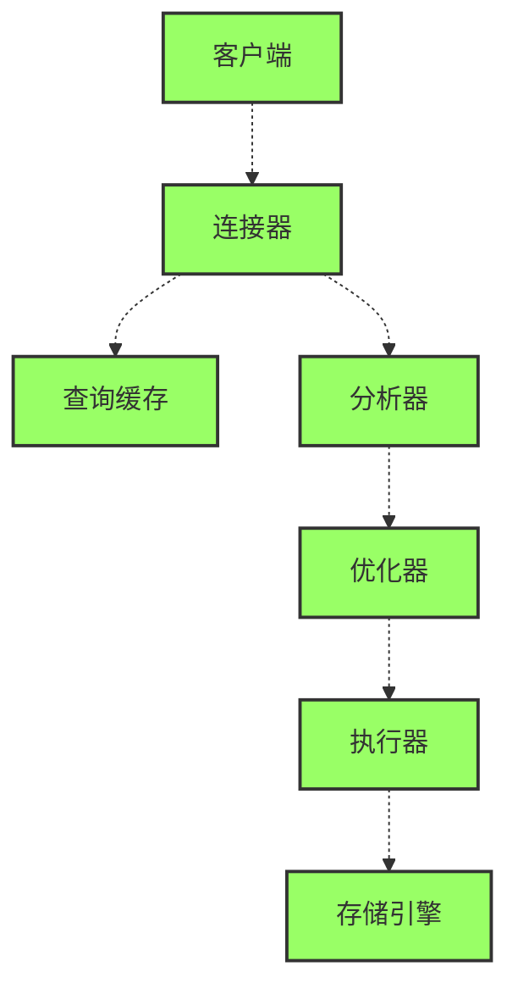
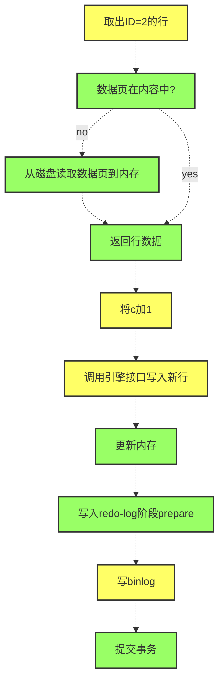

[查询语句执行流程](#查询语句执行流程)
[从更新语句初见日志系统](#从更新语句初见日志系统)

# 查询语句执行流程

- 连接器：负责建立客户端连接，获取权限，维持和管理连接。
- 查询缓存：执行的语句及结果以kv形式存在缓存，命中直接返回。更新操作会清空该表所有缓存，所以缓存适用于静态不常更新的表。8.0以后缓存功能已删除。
- 分析器：sql语句做词法和语法分析，识别表名和列名，判断表、列是否存在。
- 优化器：选取索引，join时决定连接顺序。
- 执行器：判断账户表权限，打开表。调用存储引擎接口做查询。比如InnoDB引擎：
  - 没有索引，调用引擎**获取一行数据接口**，判断条件是否满足，满足放入结果集，取下一行。
  - 有索引，调用引擎**获取满足条件的一行接口**，放入结果集，取下一行满足条件的行。
  - rows_examined就是调用引擎接口的次数，一次调用引擎内部可能实际扫描多行。

# 从更新语句初见日志系统
一条更新语句也会走查询语句那一套流程：
- 连接数据库。
- 被更新的表，该清上的缓存会全部清空。
- 分析器做语法和语法分析，识别表名和列名，判断表、列是否存在。
- 优化器决定使用哪个索引。
- 执行器读取数据，更新。
但是mysql数据库系统可以恢复任一时刻的存储状态的，是因为更新流程还记录了binlog和redo log。
## redo-log
想想如果没有redo log，更新流程将是这样：从磁盘读取数据，更新后写入磁盘。这样写磁盘IO是随机的，会影响更新处理能力。

redo log实际是一种WAL（Write-Ahead Logging）技术，先写日志再异步批量写磁盘。有了redo log后，更新操作写redo log就直接返回。真正写磁盘的操作，是等log满了后或者服务空闲了，再把更新写入磁盘。

redo log也给mysql服务提供crash-safe能力，数据库异常重启后，可以通过重放log的恢复数据，之前提交的记录不会丢失。

## binlog
除了redo-log，还有binlog日志。mysql是分server层和引擎层，redo-log是InnoDb自己的日志系统，而binlog是server层的日志，所有引擎都可以使用。

binlog提供归档的功能，比如需求是恢复一个月前的数据库状态。binlog有完整的数据库变更逻辑记录，用离恢复时间点最近的数据库全量备份，再加上到恢复时间这段时间的binlog，就可以恢复到任意时间点的数据库状态。

## redo-log与binlog对比
为什么需要redo-log？
> 最开始mysql没有InnoDb引擎，自带的是MyISAM引擎，MyISAM引擎是没有redo-log的。InnoDB引擎引最初设计要支持crash-safe的能力，并没有依赖binlog（binlog是可以关了），InnoDB实现了自己的日志系统redo-log来提供。

为什么需要binlog？
> 如果需求是需要恢复1个月前的数据库状态，因为redo-log是循环写入的，文件写满后就会清除部分数据，没有信息可以恢复一个月前的状态了。主从同步和归档功能都是redo-log提供不了的。

redo-log提供异常重启恢复数据能力。主从同步复制是依赖binlog。如果有一天mysql只有InnoDB引擎了，那么也可以用redo-log来实现复制。

**redo-log是物理的**，why?这句话怎么理解？
**binlog是逻辑的**，why?这句话怎么理解？

设置innodb_flush_log_at_trx_commit为1，每次写redo-log都持久化到磁盘。
sync_binlog设置成1，每次写binlog都持久化到磁盘，保证binlog不丢失。

## update语句内部流程
比如执行这条update语句：
```
mysql> create table T(ID int primary key, c int);
mysql> update T set c=c+1 where ID=2;
```
黄色部分在server层执行，绿色在引擎层执行：


## 两阶段提交
注意到最后三部写redo-log和binlog，其中写redo-log使用了两阶段提交，如果不用两阶段提交，会有什么问题？以这条更新语句举个例子。
```
mysql> update T set c=c+1 where ID=2;
```
> **先写redo-log再写binlog**。假设在写完redo-log后mysql异常重启了，因为InnoDb引擎提供crash-safe能力，重启后可用redo-log恢复数据。这时如果需要用binlog恢复临时库，binlog会少一条更新语句，导致恢复出来的临时库数据不一致。
> **先写binlog再写redo-log**。假设在写完binlog后mysql异常重启了，重启后redo-log没有记录所以c的值还是0。临时库重放binlog会把c的值改为1，也会导致不一致。
> **先写redo-log prepare，再写binlog，再commit redo-log**。
>> 1.假设写完redo-log prepare后异常重启了，重启后有redo-log但是没有binlog，则回滚事务，丢弃更新。
>> 2.写完redo-log prepare和binlog，重启后查看redo-log prepare和binlog都有，则重新提交事务。

并且如果数据库是主从部署的，主库和从库是通过binlog进行同步的，如果redo-log和binlog不一致，也会出现主从不一致的问题。

可以看到binlog和redo-log这2份日志如果不一致，系统会出现问题。两阶段提交是不同系统维持数据一致性时常用的方案。

# 事务隔离
简单来说，事务一组数据库操作，要么都成功，要么都失败。mysql事务是在引擎层实现的，InnoDb支持事务，原生的MySIAM不支持。以InnoDB为例，了解mysql的事务。
为保证事务，需要保证4个特性，ACID(原子性，一致性，隔离性，持久性)。这里讲下事务的隔离性。